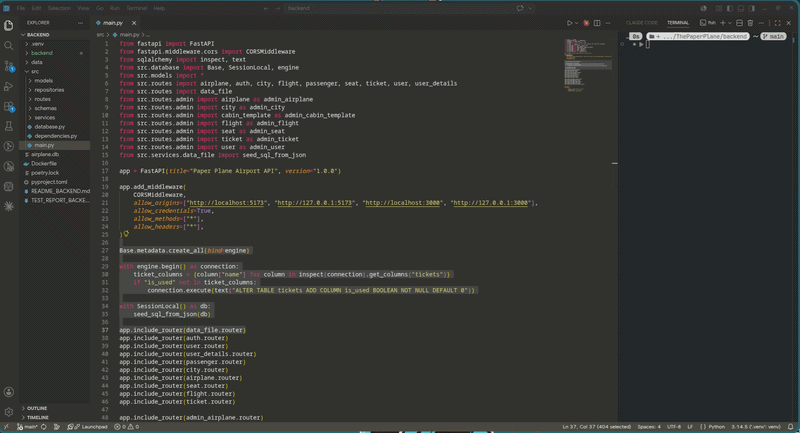

# addquickfile README

VSC extension to add files quickly like in Visual Studio

## Features

Used with default shortcut shift+f2.

After typing combination you will get window with ability to change root dir for starting to type path or script

[]

## Hot to install manually

```bash
npm install -g @vscode/vsce
vsce package
code --install-extension addquickfile-0.0.1.vsix
```
